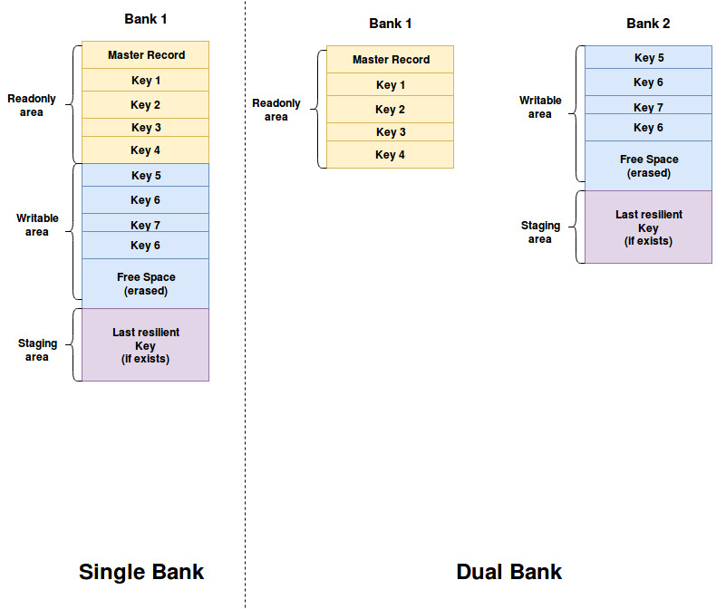
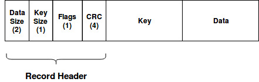

# PDBStore in Mbed OS

- [PDBStore in Mbed OS](#pdbstore-in-mbed-os)
    + [Revision history](#revision-history)
- [Introduction](#introduction)
    + [Overview and background](#overview-and-background)
    + [Requirements and assumptions](#requirements-and-assumptions)
- [System architecture and high-level design](#system-architecture-and-high-level-design)
  * [Requirements](#requirements)
  * [Design basics](#design-basics)
    + [APIs](#apis)
    + [Storage layout](#storage-layout)
    + [Storage Data Structures](#storage-data-structures)
    + [Provisioning process](#provisioning-process)
- [Detailed design](#detailed-design)
    + [Exported functions and data structures](#exported-functions-and-data-structures)
    + [Important data structures, variables and helper functions](#important-data-structures--variables-and-helper-functions)
    + [Function implementation](#function-implementation)
- [Usage scenarios and examples](#usage-scenarios-and-examples)
    + [Standard usage of the module](#standard-usage-of-the-module)
- [Other information](#other-information)
    + [Open issues](#open-issues)


### Revision history

| Revision 	| Date           	| Authors                                                	| Mbed OS version 	| Comments         	|
|----------	|----------------	|--------------------------------------------------------	|-----------------	|------------------	|
| 1.0      	| 24 March 2018	    | David Saada ([@davidsaada](https://github.com/davidsaada/)) 	| 5.13+           	| Initial revision 	|

# Introduction

### Overview and background

Pico Database Storage (PDBStore) is an ultra lightweight module that stores data on non volatile storage.
It is designated for ultra low end targets, requiring storage services in the shape of key value store (get/set APIs).
It is also resilient to power failures where required.

### Requirements and assumptions

- PDBStore currently assumes that underlying storage supports erase, write and read sizes of one byte. Extending the support for larger values would require extra logic.
- PDBStore is not thread safe.  
- No obfuscation (encryption) is required on stored data.
- No wear leveling is required for storage.
- Underlying storage is memory mapped.
- Resilience for power failures is only required for part of the stored items.
- "Zero copy" requirement, meaning that read functionality should return a pointer to the data on storage.

# System architecture and high-level design

## Requirements

PDBStore should fulfil the need to supply a storage solution for very low end targets, with very restricted resources, including the following:
- Storage size (<10KB).
- Code size (~2KB).
- RAM size (as minimal as possible).

In addition, PDBStore should have good support for pre-provisioning of the stored data,
taking the fact that the pre-provisioned data is not part of the data written during device lifetime.
    
## Design basics

PDBStore adopts a few concepts from [TDBStore](https://github.com/ARMmbed/mbed-os/blob/master/docs/design-documents/features/storage/TDBStore/TDBStore_design.md):
- Get/Set APIs, providing access to values via string keys.
- Resilience to power failures.
- Items are placed sequentially on storage: Meaning that reading a value requires scanning the storage until finding the required key. 

However, few of the requirements, such as the required small storage and code size, impose fundamental changes on our design. Here are the primary ones:
- Interface and implementation is in C.
- API set is minimal: set, get, remove and init. No APIs for iterators or incremental set.
- Zero copy requirement, along with the fact that no wear leveling is required, mean that once a key is stored, it cannot move on storage. This also means that each item's size is fixed.

So, the way PDBStore works is the following:
- When setting an item, PDBStore sequentially searches the key in the storage. If the key is not found, a record holding the key and data is appended to the end of the record list (free space start).
If the key is found, PDBStore erases its record and rewrites the data over its current location. Changing the data size is not allowed. 
- Removing an item is the same, just with an added flag telling that the key is removed (data size is retained).
- When reading an item, PDBStore sequentially scans the items until finding one (or until exhausting all stored items). If it finds one, it returns the pointer to the stored data in storage.   

As for resilience to power failures, PDBStore allocates a "staging area" at the end of the storage (large enough to store the largest item, here with data of 1KB).
When an item is set, it is first written to the staging area, and then to its designated location in storage. Then the staging area is erased.
Initialization process takes it into account and checks whether the staging area is valid. If it is, the stored item is copied to its designated location in storage.
As this action is less efficient comparing to normal writes (two pairs of erase+write instead of one), user should explicitly tell when an item is resilient in the set call, using a "resilient" flag.
Otherwise, PDBStore doesn't write the item on the staging area. 

In addition to that, PDBStore distinguishes between read only data and writable (dynamic) data. Read only data refers to the pre-provisioned data, stored on the device during provisioning stage.
Writable/dynamic data referes to the data modified by the device during its regular operation. PDBStore allows the separation of the two to different storage banks (say flash and EEPROM),
which may help if one storage resource isn't large enough to store all data. 
  
### APIs

PDBStore includes a minimal set of APIs:
- pdbstore_set: set an item
- pdbstore_get: get an item
- pdbstore_remove: remove an item
- pdbstore_init: initialize module
- pdbstore_deinit: deinitialize module (required mainly for testing)
- pdbstore_reset: reset (format) storage

Note that unlike TDBStore (or any other KVStore based classes), PDBStore allows only get/set of full items and not partial ones. In other words, PDBStore does not support incremental sets or partial gets (i.e. with an offset).
APIs are in C, as well as the entire implementation of this module.


### Storage layout

As mentioned above, we have two areas, a readonly area and a writable one. In addition, we have the staging area at the end of the writable area.
These can be either spread on one bank (holding both read only and writable areas) or two (first bank holding the read only area, second one holding writable area and staging area).
The following drawing shows the difference between the cases:



### Storage Data Structures

As mentioned above, each key is stored in a separate record on storage. Records have the following structure: 



Where:
- Data size: Size of the data (limited to 1KB).
- Key size: Size of the key (limited to 16 bytes, typically should be much less).
- Flags: Currently just the deleted flag is relevant here.
- CRC: A 32-bit CRC, calculated on header (except CRC), key and data.
- Key: Key in string format (without the null terminator).
- Data: Binary data.

All header fields are stored in network byte order (big endian).
 
The first record in the read only area is the master record. It includes a 2 byte data field, which holds the number of records in the area (in network byte order).

### Provisioning process

Provisioning process should prepare the readonly area as a binary blob, later on programmed at the start of the designated bank.
This should be done before the first time PDBStore runs on the board.   

# Detailed design

Here is a detailed explanation on how PDBStore implements its basic operations. 

In general, PDBStore is a self contained module, not using any services from the operating system.
It interfaces the underlying storage banks via a descriptor structure, holding required bank parameters (like bank base & size and program & erase functions) per bank.
The user should pass this structure at initialization.   


### Exported functions and data structures

```C
/* Bank parameters - interface with lower layers */
typedef struct {
    uint32_t bank_size;
    void *bank_base;
    uint32_t start_offset;
    uint8_t  erase_val;
    int (*prog_func)(const void * /* buffer */, uint32_t /*addr*/, uint32_t /* size */);
    int (*erase_func)(uint32_t /*addr*/, uint32_t /* size */);
} pdbstore_bank_params_t;

#define PDBSTORE_MAX_BANKS 2

/* Dual bank case */
#define PDBSTORE_READONLY_BANK 0
#define PDBSTORE_WRITABLE_BANK 1

/* Single bank case */
#define PDBSTORE_READONLY_WRITABLE_BANK 0

/* Supported flags */
#define PDBSTORE_FLAG_NONE      0x00
#define PDBSTORE_FLAG_RESILIENT 0x01

/* Key & data sizes */
#define PDBSTORE_MAX_KEY_SIZE  16
#define PDBSTORE_MAX_DATA_SIZE 1024

/* APIs */

int pdbstore_init(int init_num_banks, pdbstore_bank_params_t *init_bank_params);

int pdbstore_deinit();

int pdbstore_reset(); 

int pdbstore_get(const char *key, void **data, size_t *actual_size);

int pdbstore_set(const char *key, const void *data, size_t data_size, uint8_t flags);

int pdbstore_remove(const char *key);
```


### Important data structures, variables and helper functions

```C
pdbstore_bank_params_t bank_params[PDBSTORE_MAX_BANKS];

/* Areas */
typedef enum {
    FIRST_AREA = 0,
    AREA_INDEX_READONLY = FIRST_AREA,
    AREA_INDEX_WRITABLE,
    AREA_INDEX_STAGING,
    NUM_AREAS
} area_index_e;

#define PDBSTORE_FLAG_DELETE 0x80

/* Area parameters */
typedef struct {
    uint32_t address;
    uint32_t size;
    pdbstore_bank_params_t *bank_params;
} pdbstore_area_params_t;

static pdbstore_area_params_t area_params[NUM_AREAS];

/* Record header */
typedef struct {
    uint16_t data_size;
    uint8_t  key_size;
    uint8_t  flags;
    uint32_t crc;
} record_header_t;

/* Master record data */
typedef struct {
    /* Number of keys in the readonly area */
    uint16_t num_keys;
} master_record_data_t;

static bool initialized = false;
static uint32_t free_space_offset;

/* Worker function for set and remove */
int pdbstore_do_set(const char *key, const void *data, size_t data_size, uint8_t flags);

/* Helper function to find a record by key */
int pdbstore_find_record(const char *key, area_index_e *area, uint32_t *offset);
```

### Function implementation

**pdbstore_init function**

Header:  

`int pdbstore_init(int init_num_banks, pdbstore_bank_params_t *init_bank_params);`

Pseudo code:  

- If `initialized` return OK.
- Check validity of master record in readonly area, return error if invalid.
- Traverse readonly area with number of records from master record
    - Read next record 
    - If record is corrupt, return error.
- If number of banks is 1
    - Set start of writable area to end of readonly area.
- Else
    - Set start of writable area to start of second bank.
- Calculate size and offset of staging area according to largest record and update writable area size accordingly.
- If staging area holds a valid record
    - Keep key in a `staging_key` variable and data size in `staging_data_size`      
- Traverse writable area
    - Read next record 
    - If key equals `staging_key` and record is either OK or corrupt with the same data size as `staging_data_size`
        - Erase record and copy record from staging area here
    - Else if record is corrupt
        - Set `free_space_offset` to be the start of the record.
        - Erase area from `free_space_offset` to the end of the writable area (if not erased)
        - Exit loop
- Erase staging area (if not erased)   
- Set `initialized` to true.
- Return OK.
  
**pdbstore_deinit function**

Header:  

`int pdbstore_deinit();`

Pseudo code:  

- If not `initialized`, return OK.
- Set `initialized` to false.
- Return OK.

**pdbstore_reset function**

Header:  

`int pdbstore_reset();`

Pseudo code:  

- if not `initialized`, return "not initialized" error.
- Erase writable area.
- Set `free_space_offset` to the start of writable area.
- Return OK.

**pdbstore_do_set function**

Header:  

`int pdbstore_do_set(const char *key, const void *data, size_t data_size, uint8_t flags);`

Pseudo code:  

- if not `initialized`, return "not initialized" error.
- Call `pdbstore_find_record` with `key`.
- If return code is OK (record found)
    - Set `record_found` local boolean flag to true.
    - If area is read only area, return "read only" error.
    - Read record header
    - If header's `data_size` field is not equal to `data_size`, return "invalid size" error.
- Else
    - If flags include the remove flag, return "Not found" error. 
    - Calculate space required for record
    - If not enough space after `free_space_offset`, retun "insufficient space" error.
- Construct record header
- Calculate CRC on header, key and data
- If `flags` include the resilient flag
    - Write header, key & data at the staging area, return "write error" on failure.
- If `record_found`
    - Erase all record starting `flags` field, return "write error" on failure.
    - Write flags, CRC, key & data at their current locations, return "write error" on failure.
- Else      
    - Write header, key & buffer at `free_space_offset`, return "write error" on failure.
    - Advance `free_space_offset` by record size.
- Reread record and cacluclate CRC. Return "Write error" if not matching.  
- If `flags` include the resilient flag
    - Erase staging area
- Return OK.

**pdbstore_get function**

Header:  

`int pdbstore_get(const char *key, void **data, size_t *actual_size);`

Pseudo code:  

- if not `initialized`, return "not initialized" error.
- Call `pdbstore_find_record` with `key`.
- If return code is not OK, return return code.
- Read header to a local `header` variable
- If flags include the deleted flag, return "not found error"
- Set `actual_size` to `data_size` field in `header`.
- Set `data` to point to the data in storage.
- Return OK.

**pdbstore_set function**

Header:  

`int pdbstore_set(const char *key, const void *data, size_t data_size, uint8_t flags);`

Pseudo code:  

- Return call to `pdbstore_do_set` function with `key`, `data`, `data_size` and `flags`.

**pdbstore_remove function**

Header:  

`int pdbstore_remove(const char *key);`

Pseudo code:  
- Return call to `pdbstore_do_set` function with `key`, delete flag set in flags and empty data with 0 size.

**pdbstore_find_record function**

Header:  

`int pdbstore_find_record(const char *key, area_index_e *area, uint32_t *offset);`

Pseudo code:
- Loop with `area` on readonly and writable areas
    - Set `offset` to start of area.
    - While `offset` not reached area end
        - Read header to local variable `header`
        - Calculate CRC on header (except CRC field), key and data.    
        - If calculated CRC doesn't match CRC in `header`, return "data corrupt" error.
        - If key field in `header` matches `key` argument, return OK.
        - Increment `offset` by record size.
- Return "not found" error.


# Usage scenarios and examples

### Standard usage of the module

The following example code shows standard use of the PDBStore module:

**Standard usage example**

```C

/* Our first bank: 
   Here we have provisioning data of 2KB stored separately in flash offset of 5KB.
   Flash is pointed to by flash_base (program and erase functions are not relevant). 
   Our second bank:
   Dynamic data is stored in a fully used 6KB EEPROM (offset 0, size 6KB).
   EEPROM is pointed to by eeprom_base, Program and erase functions are eeprom_prog & eeprom_erase respectively.
   EEPROM erase value is 0xFF. 
*/
extern void *flash_base;
extern void *eeprom_base;
extern int eeprom_prog(const void * buffer, uint32_t addr, uint32_t size);
extern int eeprom_erase(uint32_t addr, uint32_t size);

pdbstore_bank_params_t bank_params[] = {
{.bank_size = 2 * 1024, .bank_base = flash_base,  .start_offset = 5 * 1024},
{.bank_size = 6 * 1024, .bank_base = eeprom_base, .start_offset = 0, .prog_func = eeprom_prog, .erase_func = eeprom_erase, .erase_val = 0xFF}
};

int res;

/* Initialize pdbstore with our two banks */
res = pdbstore_init(2, bank_params);

/* Reset our writable storage (readonly stays untouched) */
res = pdbstore_reset();

/* Add "Key1" */
const char *val1 = "Value of key 1";
const char *val2 = "Updated value of key 1";
res = pdbstore_set("Key1", val1, sizeof(val1), PDBSTORE_FLAG_NONE);
/* Update value of "Key1" */
res = pdbstore_set("Key1", val2, sizeof(val2), PDBSTORE_FLAG_NONE);

uint_8 value[32];
size_t actual_size;
/* Get value of "Key1". Value should return the updated value. */
res = pdbstore_get("Key1", value, sizeof(value), &actual_size);

/* Remove "Key1" */
res = pdbstore_remove("Key1");

/* Set value of "Key2", should be resilient to power failures */
const char *val3 = "Resilient value of key 2";
res = pdbstore_set("Key2", val3, sizeof(val3), PDBSTORE_FLAG_RESILIENT);

// Deinitialize PDBStore
res = pdbstore_deinit();
```

# Other information

### Open issues

